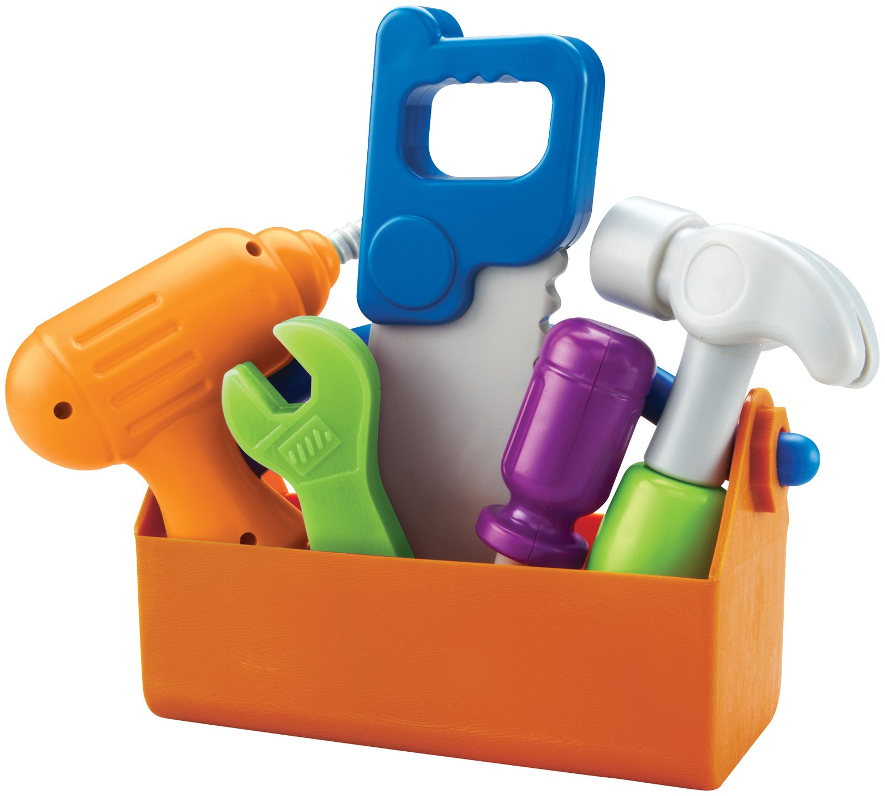

Wrapping Up ggplot + Grammar of Data Manipulation
========================================================
author: Albert Y. Kim
date: Friday 2015/01/30

UC Berkeley Admissions
========================================================

* stat identity business
* difference between
* aes()
* View()
* Explain qplot

Simpsons' Paradox
========================================================

Next in our Data Toolbox...
========================================================

Data "Wrangling"
========================================================
Another term increasing in usage is **"data wrangling"**.  The [New York Times](http://www.nytimes.com/2014/08/18/technology/for-big-data-scientists-hurdle-to-insights-is-janitor-work.html) takes a rather pessimistic view of the work.

Grammar of Data Manipulation
========================================================
Most data manipulations can be achieved by the following **verbs** on a "tidy" data frame:

1. **`filter`**: keep rows matching criteria
2. **`summarise`**: reduce variables to values
3. **`mutate`**: add new variables
4. **`arrange`**: reorder rows
5. **`select`**: pick columns by name

Each of these is a command from the `dplyr` package.

Grammar of Data Manipulation
========================================================
The beauty of this "grammar" (and the grammar of graphics) is that it is programming language/software **agnostic**.  Even if later on your don't end up using R, the previous five verbs is still how you would think about manipulating your data.

Other Important Concepts
========================================================

* **piping**: the `%>%` command, described as "_then_". This saves you from a morass of nesting.  Ex:  say `f()` and `g()` and `h()` are functions.  On data `x` you can do
    + `f(g(h(x)))` OR
    + `h(x) %>% g() %>% f()`
* **grouping**: define groupings on a categorical variable via the `group_by()` command that is useful for `summarise()`'ations.
* **boolean algebra**:  statements that evaluate to `TRUE` or `FALSE`.

Other Concepts:  piping
========================================================

The `%>%` command, described as "_then_". This saves you from a morass of nesting.

For example ex:  say you want to apply functions `h()` and `g()` and then `f()` on data `x`.  You can do

* `f(g(h(x)))` OR
* `h(x) %>% g() %>% f()`

This allows for sequential breaking down of tasks, allowing you and **more importantly** others to understand what you are doing!

Other Concepts:  Boolean Algebra
========================================================

* `==` equals
    + Ex: `5 == 3` yields `FALSE`
* `!=` not equal to
    + Ex: `5 != 3` yields `TRUE`
* `|` or
    + Ex: `5 < 3 | 5 < 10` yields `TRUE`
* `&` and
    + Ex: `5 < 3 | 5 < 10` yields `FALSE`
* `%in%` is x in y?
    + Ex:  `c(1, 3, 2) %in% c(1, 2)` yields `TRUE FALSE  TRUE`

Cheat Sheet
========================================================
Get comfortable with this: [dplyr cheat sheet](http://www.rstudio.com/wp-content/uploads/2015/01/data-wrangling-cheatsheet.pdf) from the folks at RStudio.

