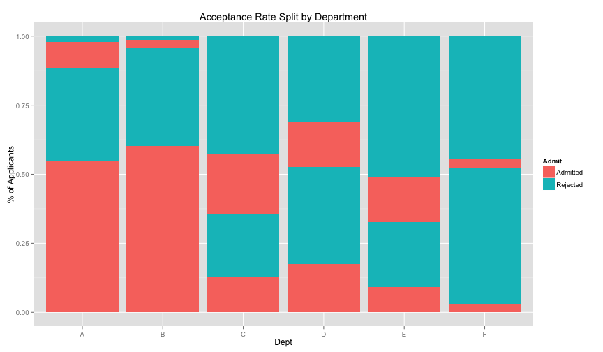
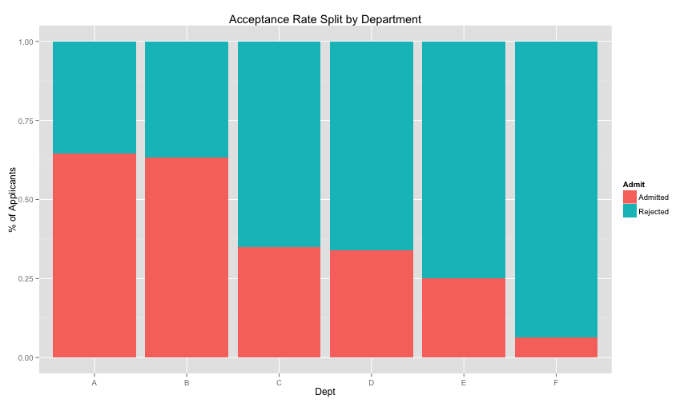

More dplyr
========================================================
author: Albert Y. Kim
date: Monday 2015/02/02


Annoucements
========================================================

* My office hours will be Monday and Wednesday 2:30-4:00
* Rich Majerus has R office hours on Thursdays 10-12 (or by appointment) in ETC 223.  Google search "Data at Reed"


Cheat Sheet
========================================================
Get comfortable with this: [dplyr cheat sheet](http://www.rstudio.com/wp-content/uploads/2015/01/data-wrangling-cheatsheet.pdf) from the folks at RStudio.


Last Time
========================================================
 


From Last Time: Data Needs Aggregating
========================================================

```r
tbl_df(UCB)
```

```
Source: local data frame [24 x 4]

      Admit Gender Dept Freq
1  Admitted   Male    A  512
2  Rejected   Male    A  313
3  Admitted Female    A   89
4  Rejected Female    A   19
5  Admitted   Male    B  353
6  Rejected   Male    B  207
7  Admitted Female    B   17
8  Rejected Female    B    8
9  Admitted   Male    C  120
10 Rejected   Male    C  205
..      ...    ...  ...  ...
```


From Last Time: "Collapse" over Gender
========================================================

```r
tbl_df(UCB) %>% group_by(Admit, Dept) %>% summarize(Freq=sum(Freq))
```

```
Source: local data frame [12 x 3]
Groups: Admit

      Admit Dept Freq
1  Admitted    A  601
2  Admitted    B  370
3  Admitted    C  322
4  Admitted    D  269
5  Admitted    E  147
6  Admitted    F   46
7  Rejected    A  332
8  Rejected    B  215
9  Rejected    C  596
10 Rejected    D  523
11 Rejected    E  437
12 Rejected    F  668
```


From Last Time: "Collapse" over Gender
========================================================
 


