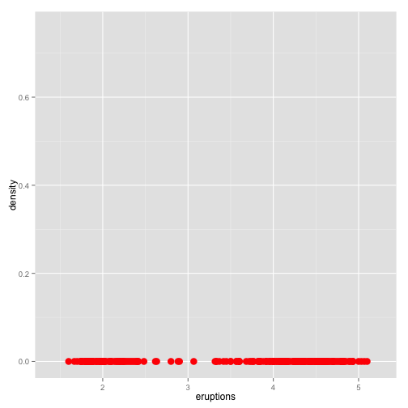
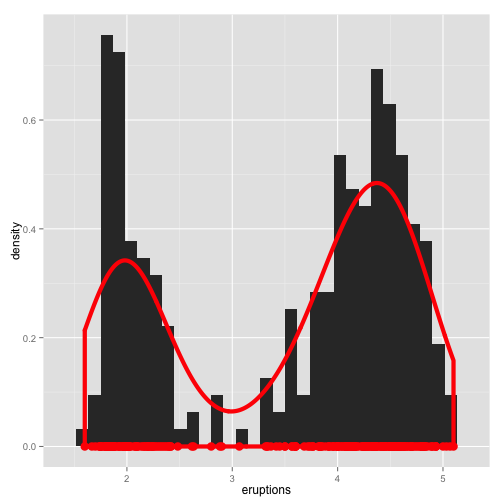
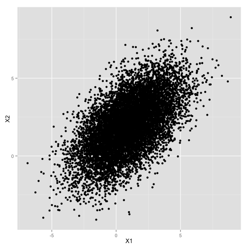
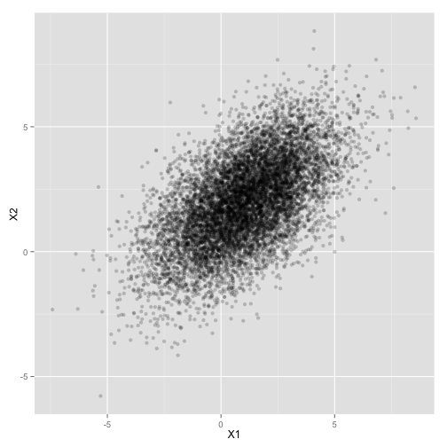
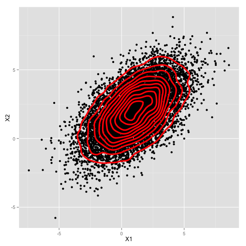

Density Plots
========================================================
author: Albert Y. Kim
date: Wednesday 2015/04/01


Density
========================================================
In probability theory, a probability density function (PDF), or density of a continuous random variable, is a function that describes the relative likelihood for this random variable to take on a given value.

The area under the curve of a density is 1 i.e. 100%.


Density
========================================================


One-Dimensional Case
========================================================
Say you have observations $(x_1, \ldots, x_n)$ of some continuous random variable.  Example the Old Faithful geyser in Yellowstone National Park eruption times


```
  [1] 3.600 1.800 3.333 2.283 4.533
  [6] 2.883 4.700 3.600 1.950 4.350
 [11] 1.833 3.917 4.200 1.750 4.700
 [16] 2.167 1.750 4.800 1.600 4.250
 [21] 1.800 1.750 3.450 3.067 4.533
 [26] 3.600 1.967 4.083 3.850 4.433
 [31] 4.300 4.467 3.367 4.033 3.833
 [36] 2.017 1.867 4.833 1.833 4.783
 [41] 4.350 1.883 4.567 1.750 4.533
 [46] 3.317 3.833 2.100 4.633 2.000
 [51] 4.800 4.716 1.833 4.833 1.733
 [56] 4.883 3.717 1.667 4.567 4.317
 [61] 2.233 4.500 1.750 4.800 1.817
 [66] 4.400 4.167 4.700 2.067 4.700
 [71] 4.033 1.967 4.500 4.000 1.983
 [76] 5.067 2.017 4.567 3.883 3.600
 [81] 4.133 4.333 4.100 2.633 4.067
 [86] 4.933 3.950 4.517 2.167 4.000
 [91] 2.200 4.333 1.867 4.817 1.833
 [96] 4.300 4.667 3.750 1.867 4.900
[101] 2.483 4.367 2.100 4.500 4.050
[106] 1.867 4.700 1.783 4.850 3.683
[111] 4.733 2.300 4.900 4.417 1.700
[116] 4.633 2.317 4.600 1.817 4.417
[121] 2.617 4.067 4.250 1.967 4.600
[126] 3.767 1.917 4.500 2.267 4.650
[131] 1.867 4.167 2.800 4.333 1.833
[136] 4.383 1.883 4.933 2.033 3.733
[141] 4.233 2.233 4.533 4.817 4.333
[146] 1.983 4.633 2.017 5.100 1.800
[151] 5.033 4.000 2.400 4.600 3.567
[156] 4.000 4.500 4.083 1.800 3.967
[161] 2.200 4.150 2.000 3.833 3.500
[166] 4.583 2.367 5.000 1.933 4.617
[171] 1.917 2.083 4.583 3.333 4.167
[176] 4.333 4.500 2.417 4.000 4.167
[181] 1.883 4.583 4.250 3.767 2.033
[186] 4.433 4.083 1.833 4.417 2.183
[191] 4.800 1.833 4.800 4.100 3.966
[196] 4.233 3.500 4.366 2.250 4.667
[201] 2.100 4.350 4.133 1.867 4.600
[206] 1.783 4.367 3.850 1.933 4.500
[211] 2.383 4.700 1.867 3.833 3.417
[216] 4.233 2.400 4.800 2.000 4.150
[221] 1.867 4.267 1.750 4.483 4.000
[226] 4.117 4.083 4.267 3.917 4.550
[231] 4.083 2.417 4.183 2.217 4.450
[236] 1.883 1.850 4.283 3.950 2.333
[241] 4.150 2.350 4.933 2.900 4.583
[246] 3.833 2.083 4.367 2.133 4.350
[251] 2.200 4.450 3.567 4.500 4.150
[256] 3.817 3.917 4.450 2.000 4.283
[261] 4.767 4.533 1.850 4.250 1.983
[266] 2.250 4.750 4.117 2.150 4.417
[271] 1.817 4.467
```


One-Dimensional Case
========================================================
The simplest approximation to $(x_1, \ldots, x_n)$'s density is a histogram where on the y-axis we are not representing **counts**, but rather **proportions**.  i.e. the sum of the area of the boxes is 1.

Density is the more general term for proportion.


One-Dimensional Case
========================================================
 


One-Dimensional Case
========================================================
 


Density Curve in Red
========================================================
 


Two Dimensions
========================================================

For two dimensions, each observation is a pair of points $(x_i, y_i)$ for $i=1, \ldots, n$. Now

* Our bins are actually boxes, not intervals
* A histogram for these would require a third dimension sticking out of the page to show the height
  corresponding to each box


Two Dimensions
========================================================

So rather we have **concentric circles** indicate density.  We use the `geom_density2d()` command on the front of your cheatsheet under two variables.


Example
========================================================
 


Setting alpha Parameter in geom_point()
========================================================
 


Concentric Circles Representing Densities
========================================================
 


Today's Example
========================================================


