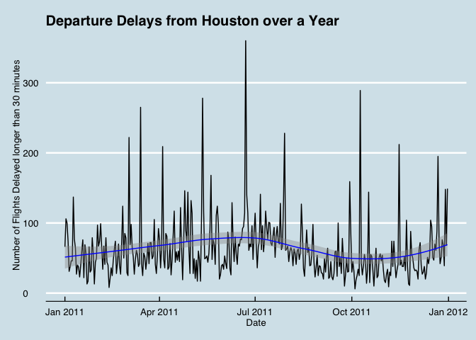
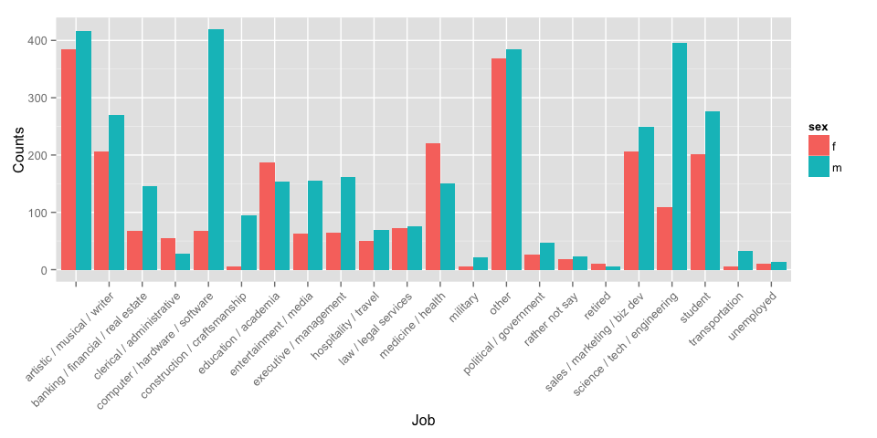

# Case Studies in Statistical Analysis AKA Data Science

This is the GitHub repository for Reed College's Spring 2015 MATH 241 Case Studies in Statistical Analysis AKA Data Science.  

* All slide presentations from this class can be found at [RPubs](http://rpubs.com/rudeboybert/) and is tagged: MATH 241.
* The syllabus can be found at [here](https://docs.google.com/spreadsheets/d/1HQPtHvPLQl_meSeJK372oXmkY7BVD4rCOamMSwTfaBI/pubhtml?gid=0&single=true).
* The summary presentation titled "Teaching Data Science to Undergrads: an ex-Googler’s Tales from the Trenches" can be found at [RPubs](http://rpubs.com/rudeboybert/Teaching_Data_Science_Ugrads).  The code to generate the slides can be found in the directory `Teaching_Data_Science_Ugrads`.

                               

## Examples

### Flight data from Houston Airport (IAH)

Credit to Rennie Meyers

 

### Sex breakdown for different jobs on San Francisco OkCupid

Credit to Miguel Connor

 
