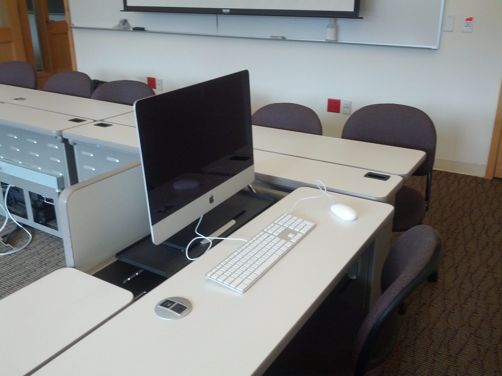
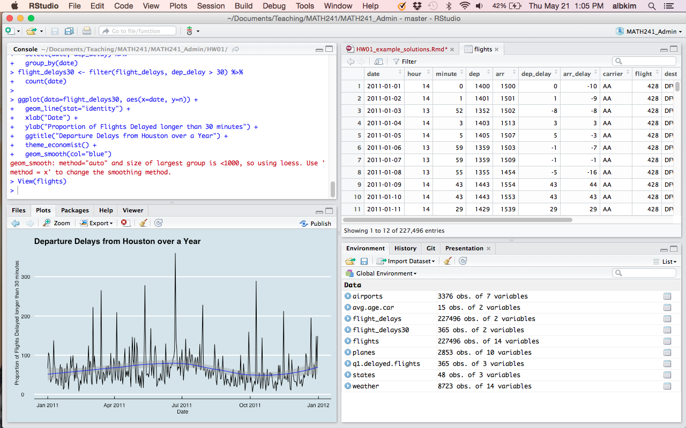
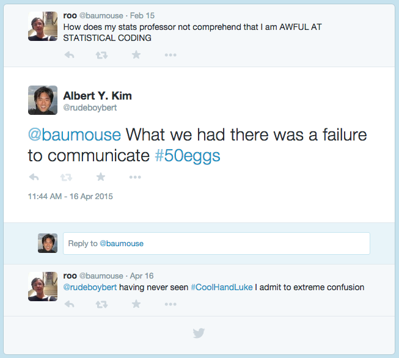

<style>
h2 { 
 color: #3399ff;		
}
h3 { 
 color: #3399ff;		
}
</style>

<div class="notes">
This is my *note*.
- It can contain markdown
- like this list
</div>

```{r, echo=FALSE}
suppressPackageStartupMessages(library(ggplot2))
suppressPackageStartupMessages(library(ggthemes))
suppressPackageStartupMessages(library(dplyr))
suppressPackageStartupMessages(library(tidyr))
suppressPackageStartupMessages(library(knitr))
suppressPackageStartupMessages(library(stringr))
suppressPackageStartupMessages(library(lubridate))
suppressPackageStartupMessages(library(Quandl))
suppressPackageStartupMessages(library(scales))
suppressPackageStartupMessages(library(rgdal))
Quandl.auth("izVwTt9m5VoEe7TsEzdr")
```


# Background

## HUM 110

All Reed freshman are required to take Humanities 110.

<center></center>


## Statistics at Reed

> - Statistics within the math department
> - Classes:
    + Intro stats
    + Year-long junior level prob & math stats sequence
    + Applied/methods classes in other departments
> - New class: **MATH241 Case Studies in Statistical Analysis**


## Data Science

<center></center>


# Class Description

## Class Structure

### Prereqs

Only intro stats and some exposure to R

### Syllabus

* 5 biweekly mini-reports submitted in R Markdown: **reproducible research**
* Term project: both report and 20 min oral
* In-class participation


## Classroom

<center></center>


## Classroom

<center></center>


## Demographics

18 students, mostly juniors and seniors.  

```{r, warning=FALSE, message=FALSE, echo=FALSE}
counts.orig <- read.csv("data/MATH_241_S.csv", header=TRUE, stringsAsFactors = FALSE) %>%
  group_by(major) %>%
  summarise(count=n()) %>%
  arrange(desc(count))

counts <- data.frame(
  Major = c(
    "Mathematics",
    "Social Science: Political Science, Sociology",
    "Economics",
    "Biological Science: Biology & Biochem and Molecular Biology",
    "Other Science: Chemistry, Environmental Studies, Physics",
    "Misc: Psychology, Linguistics"
  ),
  Count = c(4, 2, 2, 4, 4, 2)
) %>% arrange(desc(Count))

counts %>% kable()
```


## In Practice

> - Real data i.e. messy & needing cleaning, from potentially disparate sources
> - Bottom-up:  Let questions/data motivate the statistical methodology, rather than vice-versa
> - Discussions in class
> - Focus on the entire analysis pipeline: article in [Nature](http://www.nature.com/news/statistics-p-values-are-just-the-tip-of-the-iceberg-1.17412)
> - Lean on R heavily


# Tools

## Environment: RStudio

<center></center>


## How to get students to use R?

> - Key: Forget base R
> - How? The Hadleyverse of packages by [Hadley Wickham](https://github.com/hadley). <center></center>
> - In particular
    + `dplyr` package for data wrangling/manipulation
    + `ggplot2` package for data visualization


<!--
## dplyr Verbs

Data manipulation via the following **verbs** on tidy data:

1. **`filter`**: keep observations matching criteria
2. **`summarise`**: reduce many values to one
3. **`mutate`**: create new variables from existing ones
4. **`arrange`**: reorder rows
5. **`select`**: pick columns by name
6. **`join`**: join two data sets
7. **`group_by`**: group subsets of observations together

> - Moral: No matrix indexing or for loops
-->


## dplyr Package

Features

> - Data manipulation is performed using **verbs**
> - The pipe `%>%` command. For example: say you want to apply functions `h()` then `g()` then `f()` on data `x`.  You can do
    + `f(g(h(x)))` OR
    + `h(x) %>% g() %>% f()`


## Example: Houston Flights

```{r, warning=FALSE, message=FALSE, echo=FALSE, cache=TRUE}
# Load flights data
flights <- 
  read.csv("../Lec06 R Markdown + HW01/flights.csv", stringsAsFactors = FALSE) %>% 
  tbl_df() %>%
  mutate(date=as.Date(date))
weather <- 
  read.csv("../Lec06 R Markdown + HW01/weather.csv", stringsAsFactors = FALSE) %>% 
  tbl_df() %>%
  mutate(date=as.Date(date))
planes <- 
  read.csv("../Lec06 R Markdown + HW01/planes.csv", stringsAsFactors = FALSE) %>% 
  tbl_df()
airports <- 
  read.csv("../Lec06 R Markdown + HW01/airports.csv", stringsAsFactors = FALSE) %>% 
  tbl_df()
states <- 
  read.csv("../Lec06 R Markdown + HW01/states.csv", stringsAsFactors = FALSE) %>% 
  tbl_df()
```

Info on all domestic flights leaving Houston (IAH) in 2011:

* `flights`:  info on all `r formatC(nrow(flights), format="d", big.mark=',')` flights
* `planes`:  information on all `r nrow(planes)` airplanes

What are the top 5 carriers using the oldest planes (averaged over all flights)?


## Flights

The `flights` dataset:

```{r, warning=FALSE, message=FALSE, echo=FALSE, cache=TRUE}
select(flights, date, dep, arr, carrier, flight, dest, plane) %>%
  slice(1:5) %>% 
  kable()
```


## Planes

The `planes` dataset:

```{r, warning=FALSE, message=FALSE, echo=FALSE, cache=TRUE}
select(planes, plane, year, model, mfr, no.seats) %>% 
  slice(1:5) %>% 
  kable()
```


## Example: Age of Planes 

The following *sequence of verbs* wrangle/manipulate the data:

```{r, eval=FALSE}
left_join(flights, planes, by='plane') %>%
  select(carrier, plane, year) %>%
  mutate(age = 2011 - year) %>%
  group_by(carrier) %>%
  summarise(avg_age = mean(age)) %>%
  arrange(desc(avg_age)) %>%
  top_n(5)
```

```{r, warning=FALSE, message=FALSE, echo=FALSE, cache=TRUE}
airline_plane_ages <-
  flights %>%
  left_join(planes, by='plane') %>%
  select(carrier, plane, year) %>%
  mutate(age = 2011 - year) %>%
  group_by(carrier) %>%
  filter(!(is.na(year)) & plane != '') %>%
  summarise(avg_age = round(mean(age),3)) %>%
  arrange(desc(avg_age)) %>%
  top_n(5)
```


## Example: Age of Planes 

```{r, warning=FALSE, message=FALSE, echo=FALSE, cache=TRUE}
kable(airline_plane_ages)
```


## ggplot2: the Grammar of Graphics

<center>

&nbsp;&nbsp;&nbsp;&nbsp;&nbsp;

</center>


## ggplot2: the Grammar of Graphics

A statistical graphic consists of a mapping of **data** variables to **aesthetic** attributes of **geometric objects** that we can observe.

`ggplot2` allows us to construct graphics in a modular fashion by specifying these components.


## ggplot2: the Grammar of Graphics

<center></center>


## ggplot2: the Grammar of Graphics

Data (Variable)  | Aesthetic | Geometric Object
------------- | ------------- | -------------
longitude | x position | points
latitude | y position | points
army size | size = width | bars
army direction | color = brown or black | bars
date | (x,y) position | text
temperature | (x,y) position | lines


# Results


## Delayed Flights

```{r, warning=FALSE, message=FALSE, echo=FALSE, cache=TRUE}
flight_delays <- flights %>% 
  select(date, dep_delay) %>%
  group_by(date)
flight_delays30 <- filter(flight_delays, dep_delay > 30) %>%
  count(date)

ggplot(data=flight_delays30, aes(x=date, y=n)) + 
  geom_line(stat="identity") +
  xlab("Date") + 
  ylab("Proportion of Flights Delayed longer than 30 minutes") +
  ggtitle("Departure Delays from Houston over a Year") +
  theme_economist() +
  geom_smooth(col="blue")
```


## Age of Airplanes

```{r, warning=FALSE, message=FALSE, echo=FALSE, cache=TRUE}
airline_plane_ages <-
  flights %>%
  left_join(planes, by='plane') %>%
  select(carrier, plane, year) %>%
  filter(!(is.na(year)) & plane != '') %>%
  mutate(age = 2011 - year)

ggplot(airline_plane_ages, aes(x = reorder(carrier, age, FUN=median), y = age)) +
  geom_boxplot() + 
  labs(title = "Ages of airplanes flown through Houston, TX in 2011 by carrier",
       x = "Carrier",
       y = "Age (2011 - Year of Airplane)") + 
  coord_flip()
```


## Dataset: OkCupid Data

```{r, warning=FALSE, message=FALSE, echo=FALSE, cache=TRUE}
profiles <- 
  read.csv("../Lec12 Poisson Regression + HW02/profiles.csv", header=TRUE) %>% 
  tbl_df()
# Split off the essays into a separate data.frame
essays <- select(profiles, contains("essay"))
profiles <- select(profiles, -contains("essay"))
# Define a binary outcome variable: y_i = 1 if female
profiles <- profiles %>% 
  mutate(
    is.female = ifelse(sex=="f", 1, 0),
    last_online = as.Date(str_sub(last_online, 1, 10)),
    is.female = ifelse(profiles$sex=="f", 1, 0)
    )
```

> - Sample of 10% of [San Francisco OkCupid users](https://github.com/rudeboybert/JSE_OkCupid)
in June 2012 ($n=`r nrow(profiles)`$)
> - `r round(100*mean(profiles$is.female), 1)`% of the sample was female  
> - Use logistic regression to predict gender


## Job

```{r, warning=FALSE, message=FALSE, echo=FALSE, cache=TRUE}
ggplot(profiles, aes(job, fill = sex)) + 
  geom_bar(position = "dodge") + 
  xlab("Job") +
  ylab("Counts") +
  theme(axis.text.x=element_text(angle=45, hjust=1)) 
```


## Self-Referenced Body Type

*Best predictors have distinct differences (in gender) in large segments of the population.*

```{r, warning=FALSE, message=FALSE, echo=FALSE, cache=TRUE}
ggplot(profiles, aes(body_type, fill = sex)) + 
  geom_bar(position = "dodge") + 
  theme(axis.text.x=element_text(angle=45, hjust=1)) +
  xlab("Body Type") +
  ylab("Count") 
```


## Dataset: Reed Jukebox

```{r, warning=FALSE, message=FALSE, echo=FALSE, cache=TRUE}
jukebox <- read.csv("../Lec18 HW03/jukebox.csv", header=TRUE) %>% tbl_df()
```

All `r formatC(nrow(jukebox), format="d", big.mark=',')` songs played on the Reed pool hall jukebox from 2003-2009 c/o [Noah Pepper '09](http://www.noahpepper.com/)

<center></center>


## Dataset: Reed Jukebox

```{r, warning=FALSE, message=FALSE, echo=FALSE}
slice(jukebox, 1110:1112) %>% kable()
```


## Artist Popularity

```{r, echo=FALSE, message=FALSE, warning=FALSE}
jukebox <- jukebox %>%
  mutate(
    date_time = parse_date_time(date_time, "%b %d %H%M%S %Y"),
    date_time = with_tz(date_time, tz = "America/Los_Angeles"),
    week = ceiling_date(date_time, "week"),
    month = ceiling_date(date_time, "month")
  )

artists <- c("Eminem", "Talking Heads", "Girl Talk")
# We use the %in% command
pop.comparison <- filter(jukebox, artist %in% artists) %>%
  group_by(month, artist) %>%
  summarise(count=n())
# We make the actual time series a little fainter
ggplot(data=pop.comparison, aes(x=month, y=count, col=artist)) + 
  geom_line(alpha=0.5) + 
  xlab("") + ylab("Number of Times Played per Month") +
  geom_smooth(se=FALSE, size=1.25)
```


## Time Series

[quandl.com](https://www.quandl.com/) is a great source for economic data

```{r, echo=FALSE, message=FALSE, warning=FALSE, cache=TRUE}
# Get bitcoin differences
bitcoin <- Quandl("BAVERAGE/USD", start_date="2013-01-01") %>% 
  tbl_df() %>% 
  mutate(Date=ymd(Date)) %>%
  rename(price = `24h Average`) %>% 
  select(Date, price) %>%
  arrange(Date) %>% 
  mutate(
    lag.price = lag(price),
    rel.diff = (price-lag.price)/lag.price,
    type = "Bitcoin"
    ) %>%
  select(Date, rel.diff, type)

# Get gold differences
gold <- Quandl("BUNDESBANK/BBK01_WT5511", start_date="2013-01-01") %>% 
  tbl_df() %>% 
  mutate(Date=ymd(Date)) %>%
  rename(price=Value) %>% 
  arrange(Date) %>% 
  mutate(
    lag.price = lag(price),
    rel.diff = (price-lag.price)/lag.price,
    type = "Gold"
    ) %>%
  select(Date, rel.diff, type)

# Combine the two since they have the same columns and plot
combined <- bind_rows(bitcoin, gold)
ggplot(data=combined, aes(x=Date, y=rel.diff, col=type)) + 
  geom_line() + 
  scale_y_continuous(labels = percent) + 
  ylab("Day-Over-Day Relative % Change") + 
  ggtitle("Volatility of Bitcoin and Gold Prices")
```


<!--
## Maps

```{r, echo=FALSE, warning=FALSE, message=FALSE, cache=TRUE}
breast <- 
  read.csv("data/Space Time Surveillance Counts 11_05_09.txt", header=TRUE) %>% 
  rename(FIPS = StateCoTractComb) %>% tbl_df() %>%
  filter(SiteRecodeTxt == "Breast " & SexGrp == "Female") %>%
  group_by(FIPS) %>%
  summarize(cases=sum(CountOfintPatientIDNumber))

# Import census data
census <- read.csv("data/Kim_R10911893_SL140.csv", header=TRUE) %>% tbl_df() %>%
  transmute(
    FIPS = Geo_FIPS,
    pop.female = SE_T005_003,
    median.income = SE_T093_001/10000
    )

total <-
  left_join(census, breast, by="FIPS") %>%
  mutate(
    incidence = cases/pop.female,
    income.quintile = cut(median.income, 
                          quantile(median.income, probs=seq(0, 1, 0.2)), 
                          dig.lab=2, include.lowest=TRUE),
    incidence = ifelse(!is.na(incidence), incidence, 0),
    incidence.quintile = cut(incidence, 
                             quantile(incidence, probs=seq(0, 1, 0.2)), 
                             dig.lab=2, include.lowest=TRUE),
    FIPS = as.character(FIPS)
    )

# Import Western Washington shapefile, convert to data frame, and merge 
# with cancer/census data.  
ww <- readOGR(dsn="./data/ww/", layer="ww", verbose=FALSE) %>%
  fortify(region="FIPS") %>% 
  tbl_df() %>%
  inner_join(total, by = c("id"="FIPS"))

ggplot(data=ww, aes(x=long, y=lat, group = id, fill = incidence)) +
  geom_polygon() +
  geom_path(color="black", size=0.1) +
  coord_map() +
  theme_bw() + 
  xlab("longitude") + ylab("latitude") +
  scale_fill_continuous(low="white", high="deeppink3", name="Incidence") + 
  ggtitle("Breast Cancer Incidence")
```
-->


## Maps

```{r, echo=FALSE, message=FALSE, warning=FALSE, cache=TRUE}
clean.text <- function(text){
  text <- gsub("[^[:alnum:]]", "", text)
  text <- gsub(" ", "", text)
  text <- tolower(text)
  return(text)
}

# State and county map of US in 2010
US.state <- map_data("state") %>% tbl_df()
US.county <- map_data("county") %>% tbl_df()


US.state <- US.state %>%
  mutate(region=clean.text(region))
US.county <- US.county %>%
  mutate(
    region=clean.text(region),
    subregion=clean.text(subregion)
  ) %>%
  unite("county", c(region, subregion), sep="-", remove=FALSE)

# Load elections data, get county summaries, then state summaries
elections.county <-
  read.csv("../Lec26 HW04/COUNTY.csv", header=TRUE, stringsAsFactors=FALSE) %>%
  tbl_df() %>%
  mutate(
    STATE=clean.text(STATE),
    COUNTY=clean.text(COUNTY)
    ) %>%
  unite("county", c(STATE, COUNTY), sep="-", remove=FALSE) %>%
  select(county, STATE, COUNTY, BUSH, GORE) %>%
  mutate(
    N = BUSH + GORE,
    PBUSH = BUSH/N,
    PGORE = GORE/N
    )
elections.state <- elections.county %>%
  group_by(STATE) %>%
  summarise(BUSH=sum(BUSH), GORE=sum(GORE), N=sum(N)) %>%
    mutate(
    PBUSH = BUSH/N,
    PGORE = GORE/N
    )

# Join the maps with the election counts.
US.county <- inner_join(US.county, elections.county, by="county")
US.state <- inner_join(US.state, elections.state, by=c("region" = "STATE"))
```

```{r, echo=FALSE, warning=FALSE, message=FALSE, cache=TRUE}
ggplot(US.county, aes(x=long, y=lat, group=group, fill=100*(PBUSH-0.50))) +
  geom_polygon() +
  geom_path(col="black", size=0.05) +
  geom_path(data=US.state, aes(x=long, y=lat, group=group), col="black", size=0.1) +
  coord_map() +
  scale_fill_gradient2(name="", low="blue", high="red", mid="white") +
  ggtitle("2000 US Elections: Bush vs Gore")

# ggplot(US.state, aes(x=long, y=lat, group=group, fill=100*(PBUSH-0.50))) +
#   geom_polygon() +
#   geom_path(col="black", size=0.05) +
#   coord_map() +
#   scale_fill_gradient2(name="", low="blue", high="red", mid="white")
```


## Interactive Shiny Apps

* [Baby Name Popularity in US](https://rudeboybert.shinyapps.io/BabyNames/babynames.Rmd)
* [Portland Crime](https://rudeboybert.shinyapps.io/PDXCrime)
* [Insect Abundance](https://rachelgfox.shinyapps.io/Insect_Abundances/Insect_Abundances.Rmd)


# The Future

## Statistics' Image Problem

> - You hear this a lot:
    + Statistician: Hi, I'm a statistician.
    + Non-statistician:  Statistics?  I hated that class!
    
> - You'll never hear this:
    + Statistician: Hi, my work involves a lot of data visualization.
    + Non-statistician:  Data visualization?  I hate that stuff!


## Solution: Data Visualization

> - **Data visualization is a backdoor way to get students interested in statistics.**
> - Prez from Season 4 of "The Wire":
> - <center></center>


## Impact on my Intro Stats Classes

This is the only stats class many will take.

> - Get them looking at, manipulating, and visualizing data QUICK
> - Better integration of lectures and labs
> - Flipped-classroom
    + Lab exercises at home
    + Problem solving/debugging and discussion in class


<!--
## Issue: Programming

<center></center>

## Issue: Programming

> - Point-and-click vs command line.  
> - Thinking algorithmically
> - Debugging: help files and [Google](https://imgs.xkcd.com/comics/tech_support_cheat_sheet.png)
> - Not easy: like learning a language
-->


# Conclusions

## Take Home Messages

> - A class focused on the data first, methods second, using only open-source tools.
> - Rich Majerus wrote ["Why should students at a small liberal arts college learn R?"](http://blogs.reed.edu/ed-tech/2015/04/why-should-students-at-a-small-liberal-arts-college-learn-r/)
> - New tools like [Datacamp](https://www.datacamp.com/swirl-r-tutorial) are increasing the ratio: $$\frac{\mbox{Payoff from learning R}}{\mbox{Startup costs}}$$
> - Data visualization is a **gateway drug** for statistics
> - Developing skills and intuition takes time.  Instructor attention and feedback are crucial.
> - Interactivity boosts student interest  


## Resources

* Presentation slides: [RPubs.com/rudeboybert](http://rpubs.com/rudeboybert/SevenTwentyNine_Miles)
* Code and (non-private) data for class: [github.com/rudeboybert/MATH241](https://github.com/rudeboybert/MATH241)
* 17 out of 18 final projects [data & code](https://github.com/ReedCollegeMATH241)