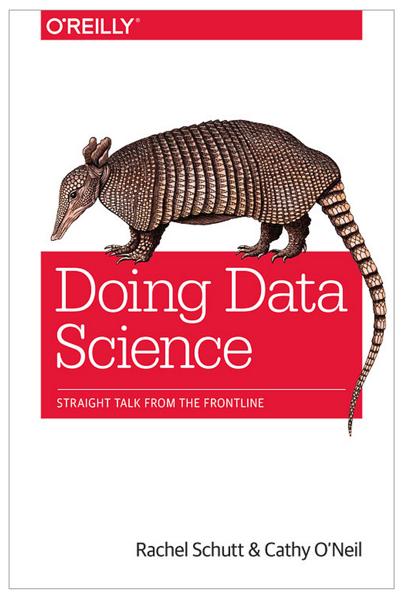
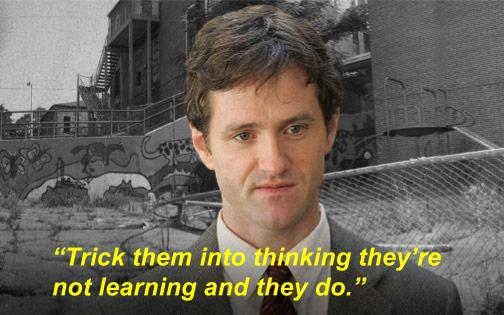

<style>
h2 { 
 color: #3399ff;		
}
h3 { 
 color: #3399ff;		
}
</style>

<div class="notes">
This is my *note*.
- It can contain markdown
- like this list
</div>

```{r, echo=FALSE}
suppressPackageStartupMessages(library(ggplot2))
suppressPackageStartupMessages(library(ggthemes))
suppressPackageStartupMessages(library(dplyr))
suppressPackageStartupMessages(library(knitr))
suppressPackageStartupMessages(library(stringr))
suppressPackageStartupMessages(library(lubridate))
suppressPackageStartupMessages(library(Quandl))
Quandl.auth("izVwTt9m5VoEe7TsEzdr")
```


# Background

## Myself

<!--
> - Undergrad in math & CS at McGill University
> - PhD in statistics at the University of Washington
> - Ads Metrics from June 2011 to March 2013
> - Visiting position at Reed College from August 2013 until now
> - Starting at Middlebury College this fall
-->
> - 
> - 
> - 
> - 
> - 


## Reed College

<center></center>


## Reed College

> - *Baby hipsters going to baby graduate school*
> - Small (1400 students) undergraduate only liberal arts college
    + Smaller class sizes
    + Very motivated and quirky student body
    + Socially progressive but academically conservative
> - Established in 1908 because founder
    + Didn't care for sports
    + Despised social clubs
> - Huge de-emphasis on grades
> - High degree of interaction between departments


## Curriculum

> - Not a vocational school 
> - Among the schools with the highest proportion of students who do a PhD
> - All students must:
    + take a junior qualifying exam
    + write a senior thesis
    + take freshman humanities class: HUM 110


## HUM 110

<center></center>


## Statistics at Reed

> - Statistics is within the math department.
> - Classes:
    + Introductory statistics
    + Year-long junior level probability & mathematical statistics sequence
    + A few methods classes in other departments
> - Until this semester, no applied stats class taught by statistician


## New Class in Spring 2015

> - MATH241: Case Studies in Statistical Analysis
> - Should have called it "Introduction to Data Science" <center></center>


## The Bigger Picture

Concern from the statistics community

* Former ASA president Marie Davidson ["Aren't we data science?"](http://magazine.amstat.org/blog/2013/07/01/datascience/)
* Former IMS president Bin Yu ["Let us own data science"](http://bulletin.imstat.org/2014/10/ims-presidential-address-let-us-own-data-science/)
* UC Davis Prof. Norman Matloff ["Statistics Losing Ground To CS, Losing Image Among Students"](http://science.slashdot.org/story/14/08/27/1219240/statistics-losing-ground-to-cs-losing-image-among-students)
<!--* Hadley Wickham ["Data science: how is it different to statistics?"](http://bulletin.imstat.org/2014/09/data-science-how-is-it-different-to-statistics%E2%80%89/)-->


## Similar Class

Former Googler Rachel Schutt taught a similar Data Science class course at Columbia University.  

<center><c/enter>


# Class Description

## Class Structure

### Prereqs

Only intro stats (know what a standard error and regression are) and some exposure to R

### Syllabus

> - 6-7 biweekly mini-reports
    + varying degree of open-endedness
    + submitted in R Markdown to encourage **reproducible research**
    + Large amount of feedback from me
> - Term project: both report and 20 min oral presentation
> - In-class participation


## Classroom

<center></center>


## Classroom

<center></center>


## Demographics

18 students, mostly juniors and seniors.  
<!-- Seniors born in 1992-1993.  Meaning.  Next years incoming frehman class was born in 1996-1997-->

```{r, warning=FALSE, message=FALSE, echo=FALSE}
counts.orig <- read.csv("data/MATH_241_S.csv", header=TRUE, stringsAsFactors = FALSE) %>%
  group_by(major) %>%
  summarise(count=n()) %>%
  arrange(desc(count))

counts <- data.frame(
  Major = c(
    "Mathematics",
    "Social Science: Political Science, Sociology",
    "Economics",
    "Biological Science: Biology & Biochem and Molecular Biology",
    "Other Science: Chemistry, Environmental Studies, Physics",
    "Misc: Psychology, Linguistics"
  ),
  Count = c(4, 2, 2, 4, 4, 2)
) %>% arrange(desc(Count))

counts %>% kable()
```


## Principles

ASA's [GAISE Reports](http://www.amstat.org/education/gaise/)

> - Use real data.
> - Stress conceptual understanding, rather than mere knowledge of procedures.
> - Foster active learning in the classroom.
> - Use technology for developing conceptual understanding and analyzing data.


## In Practice

> - Messy data, from potentially disparate sources
> - Bottom-up:  Let questions/data motivate the statistical methodology, rather than vice-versa
> - Discussions in class
> - Lean on R heavily
> - Focus on the entire analysis pipeline: article in [Nature](http://www.nature.com/news/statistics-p-values-are-just-the-tip-of-the-iceberg-1.17412)


# Tools

## Environment: RStudio

<center></center>


## How to get students to use R?

> - Key: Forget Base R
> - How? The Hadleyverse. <center></center>
> - In particular
    + `dplyr` package for data wrangling
    + `ggplot2` package for data visualization


## Data Frame

We set the restriction that all our data exists in a matrix called a **data frame**, which we say has the "tidy" property:


## dplyr Verbs

Most data manipulations can be achieved by the following **verbs** on a "tidy" data:

> 1. **`filter`**: keep rows matching criteria
> 2. **`summarise`**: reduce variables to values
> 3. **`mutate`**: add new variables
> 4. **`arrange`**: reorder rows
> 5. **`select`**: pick columns by name
> 6. **`join`**: join two data frames
> 7. **`group_by`**: group subsets of observations together


## dplyr Piping

The pipe `%>%` command, pronounced "_then_". 

For example: say you want to apply functions `h()` and `g()` and then `f()` on data `x`.  You can do

* `f(g(h(x)))` OR
* `h(x) %>% g() %>% f()`


## Example


## ggplot2: the Grammar of Graphics

<center></center>


## ggplot2: the Grammar of Graphics

A statistical graphic consists of a mapping of variables in **data** to **aesthetic** attributes of **geometric objects** that we can observe.

`ggplot2` allows us to construct graphics in a modular fashion by specifying these components.


## ggplot2: the Grammar of Graphics

<center></center>


## ggplot2: the Grammar of Graphics

Data (Variable)  | Aesthetic | Geometric Object
------------- | ------------- | -------------
longitude | x position | points
latitude | y position | points
army size | size = width | bars
army direction | color = brown or black | bars
date | (x,y) position | text
temperature | (x,y) position | lines


# Results

## HW 1: Houston Flight Data

```{r, warning=FALSE, message=FALSE, echo=FALSE, cache=TRUE}
flights <- 
  read.csv("../Lec06 R Markdown + HW01/flights.csv", stringsAsFactors = FALSE) %>% 
  tbl_df() %>%
  mutate(date=as.Date(date))
weather <- 
  read.csv("../Lec06 R Markdown + HW01/weather.csv", stringsAsFactors = FALSE) %>% 
  tbl_df() %>%
  mutate(date=as.Date(date))
planes <- 
  read.csv("../Lec06 R Markdown + HW01/planes.csv", stringsAsFactors = FALSE) %>% 
  tbl_df()
airports <- 
  read.csv("../Lec06 R Markdown + HW01/airports.csv", stringsAsFactors = FALSE) %>% 
  tbl_df()
states <- 
  read.csv("../Lec06 R Markdown + HW01/states.csv", stringsAsFactors = FALSE) %>% 
  tbl_df()
```

Dataset consisting of all `r formatC(nrow(flights), format="d", big.mark=',')` flights domestic flights leaving Houston airport (IAH) in 2011.  Four data frames:

* `flights`:  flight info
* `weather`:  hourly weather info
* `planes`:  information on all `r nrow(planes)` airplanes
* `airports`:  destination airport information


## HW 1: Delayed Flights

Rennie Meyers

```{r, warning=FALSE, message=FALSE, echo=FALSE, cache=TRUE}
flight_delays <- flights %>% 
  select(date, dep_delay) %>%
  group_by(date)
flight_delays30 <- filter(flight_delays, dep_delay > 30) %>%
  count(date)

ggplot(data=flight_delays30, aes(x=date, y=n)) + 
  geom_line(stat="identity") +
  xlab("Date") + 
  ylab("Proportion of Flights Delayed longer than 30 minutes") +
  ggtitle("Departure Delays from Houston over a Year") +
  theme_economist() +
  geom_smooth(col="blue")
```


## HW 1: Age of Airplanes

Will Jones

```{r, warning=FALSE, message=FALSE, echo=FALSE, cache=TRUE}
airline_plane_ages <-
  flights %>%
  left_join(planes, by='plane') %>%
  select(carrier, plane, year) %>%
  filter(!(is.na(year)) & plane != '') %>%
  mutate(age = 2011 - year)

ggplot(airline_plane_ages, aes(x = reorder(carrier, age, FUN=median), y = age)) +
  geom_boxplot() + 
  labs(title = "Ages of airplanes flown through Houston, TX in 2011 by carrier",
       x = "Carrier",
       y = "Age (2011 - Year of Airplane)") + 
  coord_flip()
```


## HW 1: Destination Cities

```{r, warning=FALSE, message=FALSE, echo=FALSE, cache=TRUE}
SW.flights <- filter(flights, carrier=="WN") %>% 
  inner_join(airports, by = c("dest"="iata")) %>%
  select(state, flight) 

# Import map data
state.map <- map_data("state") %>% tbl_df()
# Plot all flights
SW.flights <- count(SW.flights, state) %>% 
  left_join(states, by="state") %>%
  left_join(state.map, ., by=c("region" = "fullname"))
ggplot(data=SW.flights, aes(long, lat, group = group)) + 
  geom_polygon(aes(fill = n)) +
  geom_path(color="white") + # outline of states
  scale_fill_gradient(name="Num Flights", low='white', high='red') +
  xlab("longitude") + ylab("latitude") +
  ggtitle("SW Flights") +
  coord_map()
```


## HW 2: OkCupid Data

```{r, warning=FALSE, message=FALSE, echo=FALSE, cache=TRUE}
profiles <- 
  read.csv("../Lec12 Poisson Regression + HW02/profiles.csv", header=TRUE) %>% 
  tbl_df()
# Split off the essays into a separate data.frame
essays <- select(profiles, contains("essay"))
profiles <- select(profiles, -contains("essay"))
# Define a binary outcome variable: y_i = 1 if female
profiles <- profiles %>% 
  mutate(
    is.female = ifelse(sex=="f", 1, 0),
    last_online = as.Date(str_sub(last_online, 1, 10)),
    is.female = ifelse(profiles$sex=="f", 1, 0)
    )
```

Sample of 10% of [San Francisco OkCupid users](https://github.com/rudeboybert/JSE_OkCupid)
in June 2012 ($n=`r nrow(profiles)`$).  `r round(100*mean(profiles$is.female), 1)`% of the population was female.  

Goal was to use logistic regression to predict gender.


## HW 2: Listed Job

Miguel Connor

```{r, warning=FALSE, message=FALSE, echo=FALSE, cache=TRUE}
ggplot(profiles, aes(job, fill = sex)) + 
  geom_bar(position = "dodge") + 
  xlab("Job") +
  ylab("Counts") +
  theme(axis.text.x=element_text(angle=45, hjust=1)) 
```


## HW 2: Self-Referenced Body Type

```{r, warning=FALSE, message=FALSE, echo=FALSE, cache=TRUE}
ggplot(profiles, aes(body_type, fill = sex)) + 
  geom_bar(position = "dodge") + 
  theme(axis.text.x=element_text(angle=45, hjust=1)) +
  xlab("Body Type") +
  ylab("Count") 
```


## HW 3: Time Series


```{r, warning=FALSE, message=FALSE, echo=FALSE, cache=TRUE}
ggplot(profiles, aes(body_type, fill = sex)) + 
  geom_bar(position = "dodge") + 
  theme(axis.text.x=element_text(angle=45, hjust=1)) +
  xlab("Body Type") +
  ylab("Count") 
```


```{r, warning=FALSE, message=FALSE, echo=FALSE, cache=TRUE}

```


## Final Project


[Shiny App](https://rachelgfox.shinyapps.io/Insect_Abundances/Insect_Abundances.Rmd)


* Houston Flights data
* OkCupid data
* Reed jukebox data:  Talking Heads
* Elections data
* Quandl
* Babynames datasets
* Census data (I love FIPS codes!) joined with health data joined with shapefile data

## Topics

* Regressions, time series, spatial autocorrelation (show image), density plots (prostitution in Portland), text mining, sampling bias, First law of geography
* Webscraping using the rvest package
* GitHub and R Markdown for reproducibility
* Good programming practice (Google style guide)
* GitHub for promoting/sharing work
* Dates with lubridate
* String manipulation and basic regular expressions with stringr


## Examples:

* Importance of exploratory data analysis
    + Time zones of Reed Jukebox
    + Erroneous join of counties in US
* Miguel's quandl analysis

## Student Comments

* One econ student who used to be STATA, is now building a Shiny app for his senior thesis.
* One biology major, most useful class he's taken at Reed.
* One biology major said if she took this class earlier in her career, it would have convinced her to be a Math major.


# The Future

## Areas for Improvement

> - Statistical topics:  More on dependent data, missing data, causal inference, and some machine learning
> - Databases/SQL
> - Ask better questions of the students
> - Flipped-classroom
    + Lab exercises at home
    + Problem solving/debugging and discussion in class


## Statistics' Image Problem

> - Typical conversation
    + Me (statistician): "Hi, my name is Albert. I'm a statistician."
    + Other party:  "Statistics?  I hated that class."
> - Atypical conversation
    + Me (statistician): "Hi, my name is Albert. My work involves a lot of data visualization."
    + Other party:  "Data visualization?  I hate that stuff."


## Solution: Data Visualization

**Data visualization is a backdoor way to get students interested in statistics.**


## "Prez" from Season 4 of "The Wire"

*Trick them into thinking they're not learning and they do.*

<center></center>


## Impact on my Intro Stats Classes

This is the only stats class many will take.

> - Get them looking, manipulating, and visualizing data quick
> - Better integration of lectures and labs
> - Intro stats:  
    + Boost data visualization
    + Randomization based methods.  Tim Hesterberg's paper [What Teachers Should Know about the Bootstrap: Resampling in the Undergraduate Statistics Curriculum](http://arxiv.org/abs/1411.5279)


## Issue: Programming

<center></center>


## Issue: Programming

> - Point-and-click vs command line.  
> - Thinking algorithmically
> - Debugging: help files and [Google](https://imgs.xkcd.com/comics/tech_support_cheat_sheet.png)
> - Like learning a language


# Conclusions

## Take Home Messages

> - A statistics class focused on the data
> - Rich Majerus wrote ["Why should students at a small liberal arts college learn R?"](http://blogs.reed.edu/ed-tech/2015/04/why-should-students-at-a-small-liberal-arts-college-learn-r/)
    + He learned R using dplyr and ggplot, not base R.
    + New tools like [Datacamp](https://www.datacamp.com/swirl-r-tutorial) are increasing: $$\frac{\mbox{Payoff from learning R}}{\mbox{Startup costs}}$$
> - Data visualization as a "backdoor entrance" for statistics
> - Developing skills and intuition takes time.  At Reed classes are small: attention and feedback
> - Interactivity boosts student interest  


## Google Wisdom Imparted to Students

Presentation on 2011/06/27 given by Dierdre and Amir:

> - Look at your data ASAP.
> - Don't thrash
    + Do your due diligence, but don't overdo.
    + Seek expert advice!  
> - "You actually don’t know what you are doing until after you have done it!"
> - Do the most braindead thing first, take it end to end, then iterate and improve.
> - Fight perfectionistism: think of the marginal return of your efforts.


## Conclusion

### Ressources

In the repositories section of [github.com/rudeboybert](https://github.com/rudeboybert/repositories)

* Slides for this talk: [Teaching Data Science Ugrads](https://github.com/rudeboybert/Teaching_Data_Science_Ugrads)
* All the materials for the class: [MATH241](https://github.com/rudeboybert/MATH241)

<!--
### Thanks

* **Management**:  Diane Tang, Amir Najmi, Dierdre O'Brien, Nick Chamandy
* **Colleagues**:  All of Ads Metrics, but in particular Ryan Giordano, Jean Steiner, Henning Holdhold, Kathy Zhong
* **Others**:  Paul Muret, Victoria Clarke
-->